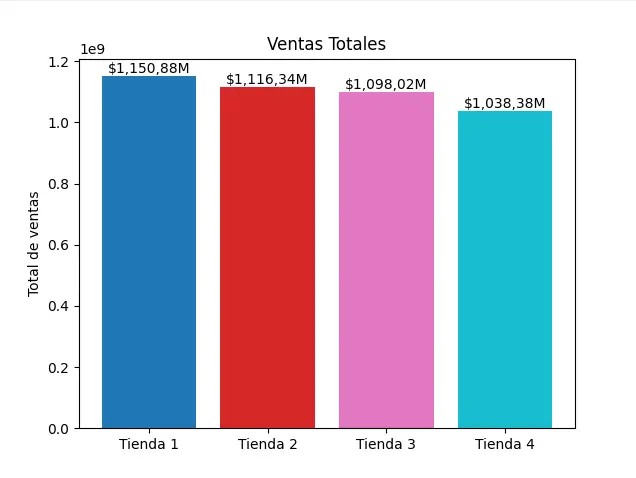

# Informe Final de Análisis de Tiendas

## Introducción

El objetivo de este análisis es determinar cuál de las cuatro tiendas disponibles representa la mejor opción de venta para el Sr. Juan. Para ello, se analizaron distintos aspectos de las tiendas: los ingresos totales, la distribución de productos por categoría, la calificación promedio otorgada por los clientes, los productos más vendidos y el coste de envío promedio. Este informe sintetiza los resultados obtenidos y concluye con una recomendación justificada.

## Análisis por Tienda

### 1. Ingresos Totales

Se calcularon los ingresos totales sumando la columna de precios de cada tienda:

- **Tienda 1**: $X1150880400.0 ( mayor ingresos )
- **Tienda 2**: $X1116343500.0
- **Tienda 3**: $X1098019600.0
- **Tienda 4**: $X1038375700.0 ( menor ingresos )

> **Gráfico**: Ingresos Totales por Tienda (Insertar aquí)

### 2. Categorías de Productos Más y Menos Vendidas

Se evaluó cuántos productos de cada categoría tiene cada tienda. Esto permite identificar qué tipo de productos dominan en el inventario y cuáles tienen menor presencia.

**Observaciones:**

- Tienda 4 tiene la categoría menos vendida de todas ( Instrumentos musicales )
- Tienda 4 presenta una sobreconcentración en la categoría de Muebles.

### 3. Calificaciones Promedio

El promedio de calificación por tienda fue:

- **Tienda 1**: ★★★★☆ (X3.9766)
- **Tienda 2**: ★★★★☆ (X4.0373)
- **Tienda 3**: ★★★★☆ (X4.0483) ( gana sin redondedo )
- **Tienda 4**: ★★★★☆ (X3.9957) ( peor tienda calificada )

> **Gráfico**: Calificación Promedio por Tienda (Insertar aquí)

### 4. Productos Más y Menos Vendidos

El número de productos por categoría también se utilizó como indicativo de ventas, asumiendo que más unidades implican mayor demanda.

**Observaciones**:

- Tienda 3 se destaca en la venta de productos de categoría Muebles.
- Tienda 4 tiene menor rotación en la categoría Instrumentos musicales.

### 5. Coste de Envío Promedio

El coste promedio de envío por tienda fue:

- **Tienda 1**: $26018.6095 ( mayor coste de envio en promedio )
- **Tienda 2**: $25216.2356
- **Tienda 3**: $24805.6803
- **Tienda 4**: $23459.4571 ( menor coste de envio en promedio )

> **Gráfico**: Costo de Envío Promedio por Tienda (Insertar aquí)

## Conclusión

Tras analizar los datos, **la tienda recomendada para que el Sr. Juan venda es la tienda 4**, debido a los siguientes motivos:

- Tiene **los ingresos mas bajos**, lo que indica un volumen de ventas bajo,
- Es la tienda que **menos ingresos tiene en la categoria de Instrumentos musicales**,
- Su **calificación promedio es la más baja**,
- Tiene **el menor coste de envío en promedio**.

la **Tienda 4** de 4 estudios hechos solo destacó en 1, que es el menor coste de envío en promedio.
Por ende, la **Tienda 4 es la mejor opción para el Sr. Juan para venderla.**
